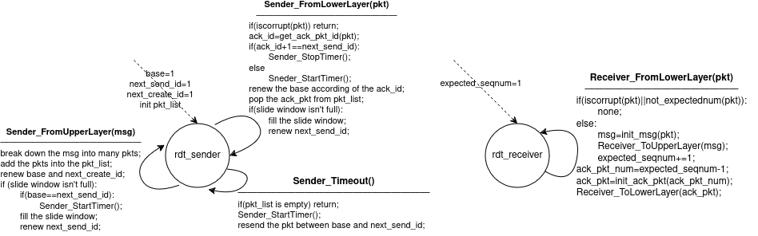

# SE3356 CloudOS Lab1 Report

author: HaoCheng Wang  
ID: 521021910225  
Email: 521021910225@sjtu.edu.cn

## Modification & Usage

- I don't modify `rdt_receiver.h`、`rdt_sender.h`、`rdt_struct.h` and `rdt_sim.cc` files
- I add `rdt_utils.cc` and `rdt_utils.h` in the project ,in order to provide general functions about constructing/destructing/checking packets and messages for rdt instances.   
    And so, I **modify the Makefile** to add this dependency.
- To use it, run `make all` , then run `./rdt_sim` as before. 

## Implementation Method
I use GBN(`《计算机网络-自顶向下方法 第七版》P143`) as the reference of my implementation.   
Additionally, because the implementation on textbook rules that the sender can refuse the msg from upper layer when slide window is full but we can't, I need a pkt_list to buffer the pkts which are created but not acknowledged in order. When some pkts are acknowledged, they will be removed from the list.  
  
You can find more comments about the global static variable in `rdt_sender.cc` and `rdt_receiver.cc`.  

## Difficulty & Solution
Debugging consuming a lot of time for me. The main diffculties I met and corresponding solution is listed below:
- Error:   
  At first, my send_bit_count and recevier_bit_count can't match. This is because when my sender receives a valid pkt, it only renew the base. But don't fullfill the silde window again. It leads that the slide window only renew in the Sender_FromUpperLayer(). If all upper calls happened at very early time, the slide window can't renew and subsequent pkts can't be sent.   
  To fix it, I make the sender can also fullfill the slide window in Sender_FormLowerLayer() if base changes. So the pkt will be sent without missing.
- Infinite Loop:  
  What's more, I sometimes meet infinite loop in test. It confuses me a lot at first. Finally I try to print out the status about receiver and sender(ex. base next_send_id next_create_id expected_seqnum) ,finding that they had already sent out and acknowledged all the pkts at a early time, and then fall in infinite loop of "Sender_Timeout()". That's because my Sender_Timeout() simply restarts the timer and resends the pkts between base and next_send_id at first. If sender gets the final ack_pkt in the Sender_FromLowerLayer() but the timeout event happens **before** we manually stop the timer, a new Sender_Timeout() will be called again later. But it only restart the timer and **don't send any pkts to receiver** because final ack_pkt has been received. And so receiver can't recevie pkt and send back ack_pkt to sender, and so the timeout event will happen again and repeat this loop.   
  To fix it, I make the Sender_Timeout() check the num of left pkts. The timer will restart only if some pkts are still not acknowledged. It takes effects.