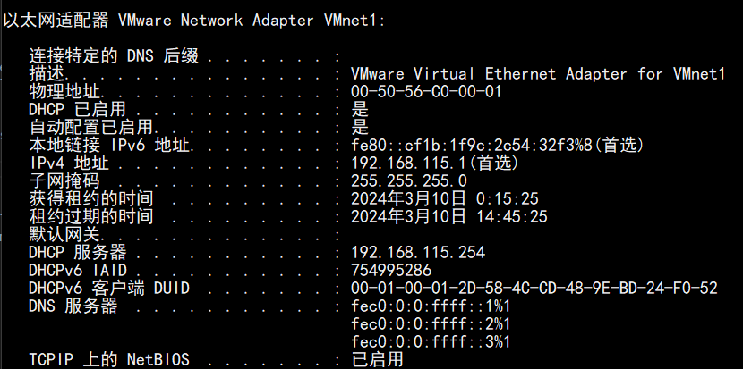
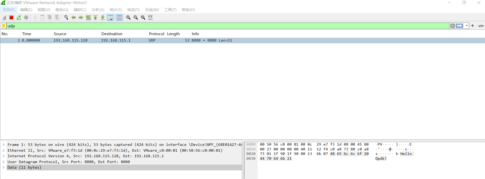

# Answer to Lab2 Part2 

## Usage
There are two methods for me to build my source file. The first is adding the depedency of dpdk shared library manually when compiling. The second is moving the file in a new directory in `dpdk/examples` and modifying the `meson.build`.I just used the latter beacuse it can use official configurations.

To use the case, you should specify the src_port, dst_port, src_ip, dst_ip, dst_mac, the src_mac can get by `rte_eth_macaddr_get()`.As for me, I run `ipconfig /all` on windows and the result is:  

Once you finish the all configuration, you can build the project in a new dir in `dpdk\examples`. Every devs you start will send a udp packet to host with the message "Hello Dpdk!".  

After build all examples, you can find an exectuable in `dpdk/build/examples` , the file name is `dpdk-<direcotry>`, \<direcotry\> is your directory name in dpdk/examples. Run it, and you can get information from wireshark on windows:  

It proves that the packet is sent by dpdk and can be received by host successfully.