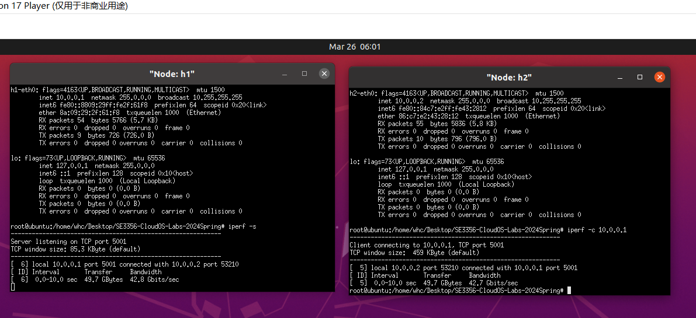
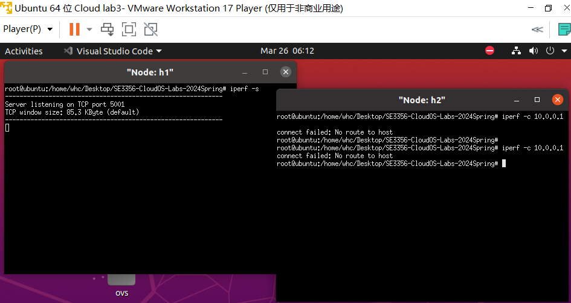
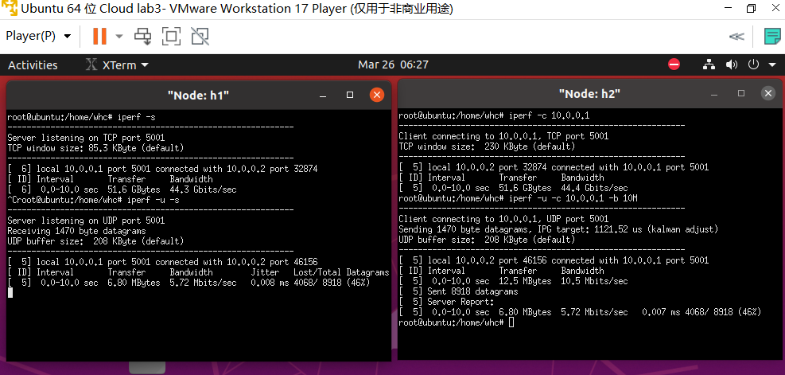
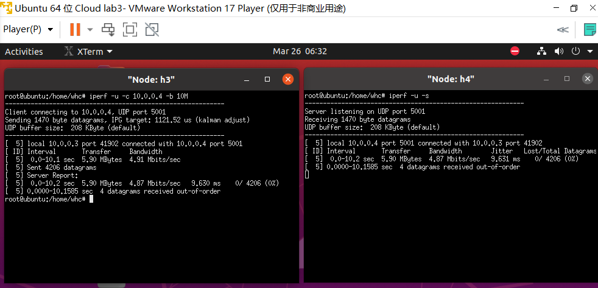
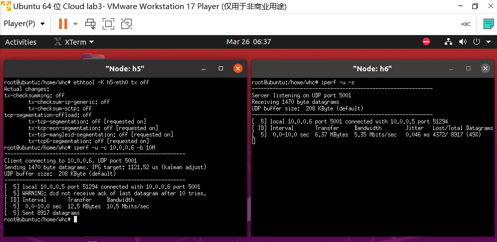
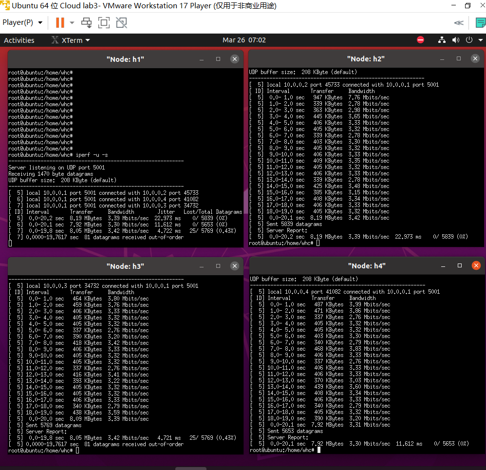
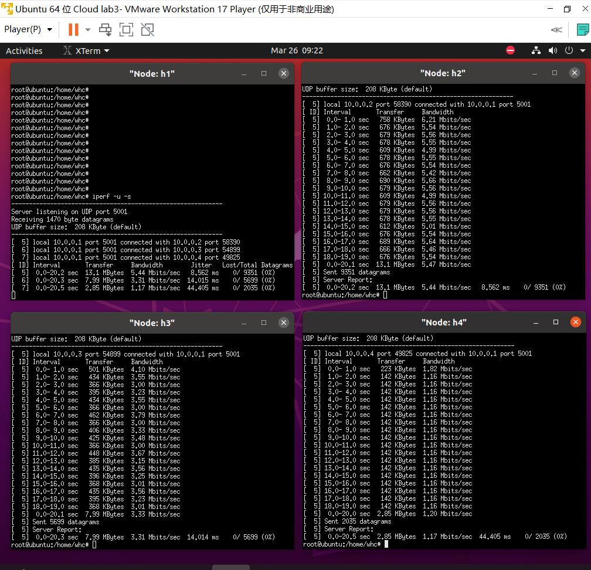

# SE3356 CloudOS Lab3

## Task 1
完成连通性测试，截图如下：  
  

可以看出h1和h2之间已正常连通

## Task 2
  

可以看到，我们使用ovs-ofctl对交换机s1添加一条flow entry, `"table=0,nw_src=10.0.0.2/24,actions=drop"`是一条符合Flow Syntax的语句，描述了此flow entry的行为：  
- 此flow entry位于flow table0
- 此flow entry匹配流的规则为：L3层（网络层）IP为10.0.0.2，24位子网掩码
- 此flow entry对匹配流的操作是：drop(丢弃)

结果上，因为所有从10.0.0.2/24发来的流都被s1丢弃，则h2上的ipef无法连接至h1 

## Task 3

### Task 3.1
   
|带宽|抖动|丢包|
|---|---|---|
|5.72 Mbits/sec|0.007 ms|4068/8918 (46%)|

### Task 3.2
  
|带宽|抖动|丢包|
|---|---|---|
|4.87 Mbits/sec|9.631 ms|0/4206 (0%)|  

### Question 1
> 19 \$ ovs-ofctl add-flow s1 in_port=5,action=meter:1,output:6 -O openflow13   
> 20 \$ ovs-ofctl dump-flows s1 -O openflow13

第19行，向s1中加入一条flow entry，-O指定了协议版本为openflow13   
flow entry对应的Flow Syntax为：  
- in_port=5：匹配从端口5进入的流
- action=meter:1,output:6：对匹配的流交给meter表1，且输出端口为6

第20行，dump-flows s1打印交换机s1中的flow entry，-O指定了协议版本为openflow13

### Task 3.3
  
|带宽|抖动|丢包|
|---|---|---|
|5.35 Mbits/sec|0.046 ms|4372/9817 (49%)|   

### Question 2
|限速方法|带宽|抖动|丢包|
|---|---|---|---|
|网卡限速|5.72 Mbits/sec|0.007 ms|4068/8918 (46%)|
|队列限速|4.87 Mbits/sec|9.631 ms|0/4206 (0%)|  
|Meter表限速|5.35 Mbits/sec|0.046 ms|4372/9817 (49%)|   

对于网卡限速和Meter表限速：可以看到，client以10M带宽发送，而超过5000Kps时，多余的部分被丢弃，结果大约50%的丢包率，这符合网卡限速和Meter表限速都简单丢弃超过部分的策略   
对于队列限速：可以看到，经过队列的平滑后，client h3的丢包率显著降低，但是对应的结果，抖动显著提升，带宽略有降低，这主要是因为队列平滑后，包可能会被临时缓存，暂不发送   

从限速效果来看，队列限速控制最严格，成功将带宽压至5M/sec以下，其他两种限速效果相对宽松，均超过了5M/sec  
从丢包率来看，队列限速丢包率最好，其他两种均为50%左右，这是因为队列限速的缓存缓发机制，平滑流量，回避了丢包问题，而剩余两种方法均简单丢弃超过的部分，自然导致丢包率极高  
从抖动来看，网卡限速和meter表限速均为较低水平，但是队列限速抖动显著高，可能是因为后者的缓存缓发机制计算复杂，波动较多，导致包的抖动率较高

## Task 4
  
可以看到，限速10M/sec，三个client稳定后，由于默认配置，带宽均在3.3Mb/sec左右

## Task 5
根据[https://docs.openvswitch.org/en/latest/faq/qos/](https://docs.openvswitch.org/en/latest/faq/qos/)的qos配置方法，采取队列限速（多队列+other config）策略，通过对应不同in_port的多个flow entries，匹配不同的流，并加入对应的配置队列，以完成对流的鉴别与控制能力

对应的脚本文件为`task5.sh`，内容如下：  
> ovs-vsctl set port s1-eth1 qos=@qos1 -- --id=@qos1 create qos type=linux-htb queues=2=@q2,3=@q3,4=@q4 -- --id=@q2 create queue other-config:min-rate=5500000 other-config:max-rate=5600000 -- --id=@q3 create queue other-config:min-rate=3300000 other-config:max-rate=3400000 -- --id=@q4 create queue other-config:min-rate=0 other-config:max-rate=1200000  
> 
> ovs-ofctl add-flow s1 cookie=2,in_port=2,action=set_queue:2,output:1  -O openflow13  
> ovs-ofctl add-flow s1 cookie=3,in_port=3,action=set_queue:3,output:1  -O openflow13
> ovs-ofctl add-flow s1 cookie=4,in_port=4,action=set_queue:4,output:1  -O openflow13

该脚本为s1-eth1配置qos策略，此策略创建了三个queue，通过other-config配置了最大流量和最小流量（适当调高了h2和h3的最小流量设置，可以更好的满足题目要求），并将对应的flow entry添加至openflow switch中，用于匹配多个端口到来的流量，加入不同的限速队列中，并最终都将转发至server对应的端口1，cookie用于标识每条flow entry     
配置完成后，运行结果如下  

  
符合题目要求  

